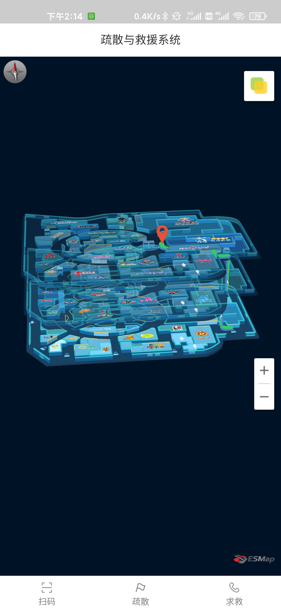
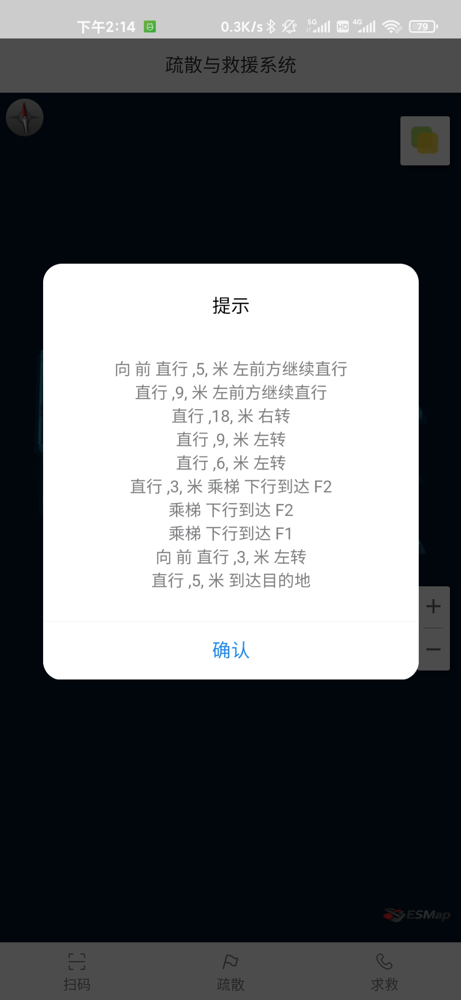
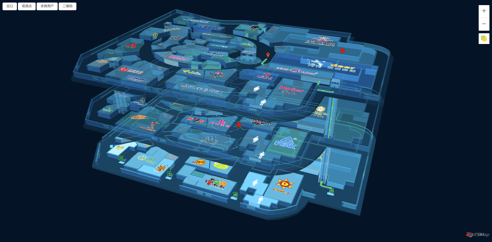
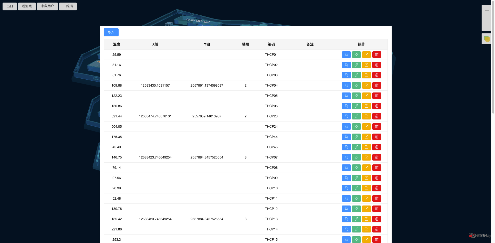
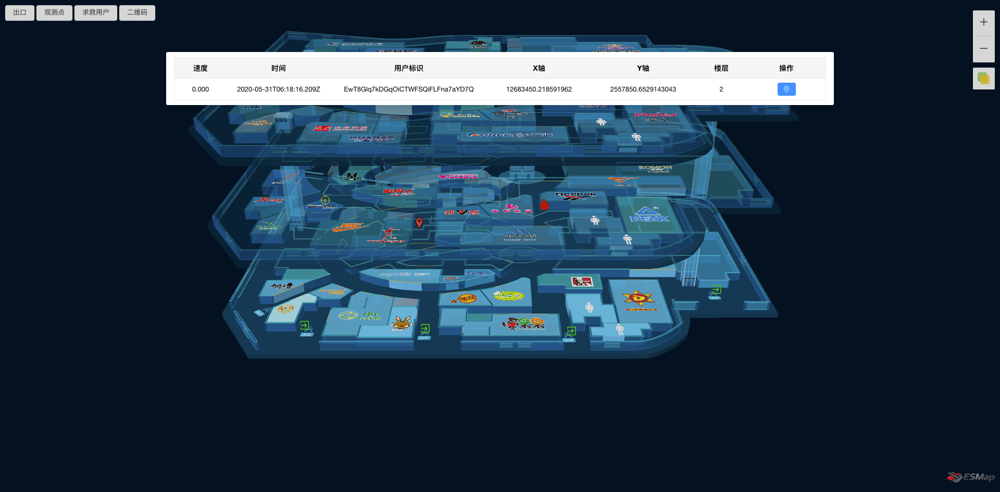

# evacuate
 
疏散与救援系统

### 技术栈

- 客户端：Vue、axios、VantUI、socket.io、vue-amap、esmap、HBuilder
- 后台管理系统：Vue、axios、HeyUI、socket.io、esmap、vue-qrcode
- 服务端：Egg、mongoose、socket.io、jsonwebtoken

##### 说明

1. 将地图上的坐标点写入二维码，贴在实地。用户扫描二维码定位，标注在地图上，进行后续规划。（由于室内定位的复杂性，故不采用 GPS）
2. 使用 `H5+GPS`、`H5+三轴计算` 估算修正用户加速度。
3. 使用 `socket.io` 进行即时通讯，传输用户移动轨迹。
4. 使用 `HBuilder` 将 `H5` 页面打包成 `APP`。

### 截图

<div align="center">
  
  
</div>

<div align="center">
  
</div>

<div align="center">
  
</div>

<div align="center">
  
</div>

### 部署

需要安装以下软件：

- [VSCode](https://code.visualstudio.com/)
- [Node.js](https://nodejs.org/zh-cn/)
- [MongoDB](https://www.mongodb.com/download-center/community)
- [HBuilderX](https://www.dcloud.io/hbuilderx.html)

##### 客户端

```bash
cd evacuate-client  //根目录
yarn  //安装依赖
yarn build  //打包
```

打开`HBuilderX`，新建项目，选择`5+App`模式，输入名称和目录。将`/evacuate-client/dist`目录下的所有文件复制到`HBuilderX`项目的根目录。在`HBuilderX`的菜单中点击`发行`，`原生APP-云打包`，上传进行打包，稍等片刻，下载APP即可。

##### 后台管理系统

```bash
cd evacuate-admin   //根目录
yarn  //安装依赖
yarn serve  //运行项目
```

根据提示URL，在浏览器打开即可。

##### 服务端

```
cd evacuate-server  //根目录
yarn  //安装依赖
yarn start  //运行项目
```
